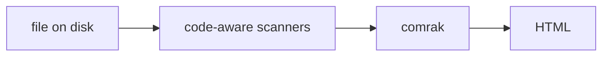

# Mermaid

The client lazy-imports mermaid only when a document actually contains one.

```mermaid
flowchart LR
  source["file on disk"] --> scan["code-aware scanners"]
  scan --> parse["comrak"]
  parse --> html["HTML"]
```
