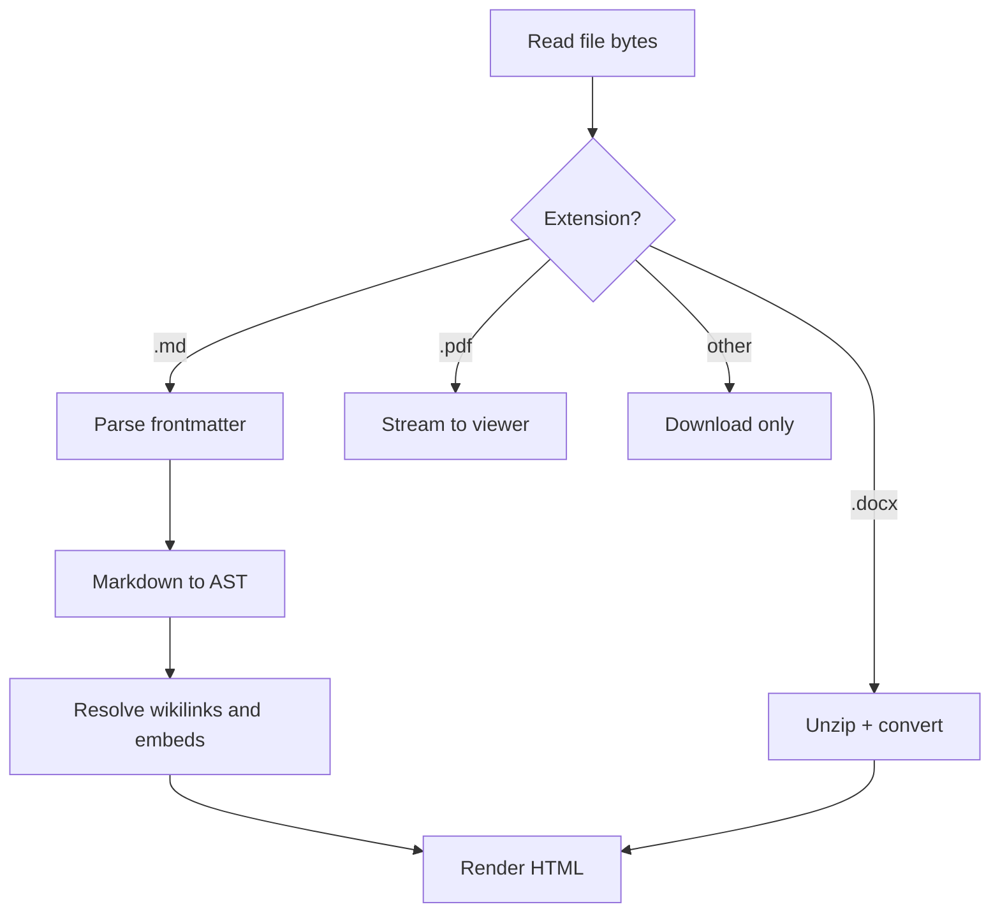

# Rendering Pipeline

Source bytes go in, HTML comes out. See [[adr-001-markdown-engine]] for why we
picked the engine, and [[projects/kbview/overview|the overview]] for context.

## Stages



## Rust: the entry point

```rust
pub struct RenderOptions {
    pub vault_mode: bool,
    pub base_href: String,
}

pub fn render_markdown(source: &str, opts: &RenderOptions) -> Result<Html, RenderError> {
    let (frontmatter, body) = split_frontmatter(source)?;
    let mut ast = parse(body);
    if opts.vault_mode {
        resolve_wikilinks(&mut ast, &opts.base_href);
    }
    Ok(to_html(&ast, frontmatter))
}
```

## Python: the fixture checker

```python
from pathlib import Path

def unresolved_links(vault: Path) -> list[str]:
    """Return every wikilink target that has no matching file."""
    names = {p.stem for p in vault.rglob("*.md")}
    missing = []
    for note in vault.rglob("*.md"):
        for target in extract_wikilinks(note.read_text(encoding="utf-8")):
            if target.split("#")[0].split("|")[0] not in names:
                missing.append(target)
    return missing
```

## JSON: the root manifest

```json
{
  "id": "obsidian-vault",
  "name": "Obsidian Vault Fixture",
  "mode": "obsidian",
  "accentColor": "#7c5cff",
  "landingPage": "index.md"
}
```

## Not a tag

```text
The line below is inside a fenced block, so #definitely-not-a-tag must never
appear in the tag index.
```

Inline code is also exempt: `#also-not-a-tag`.
