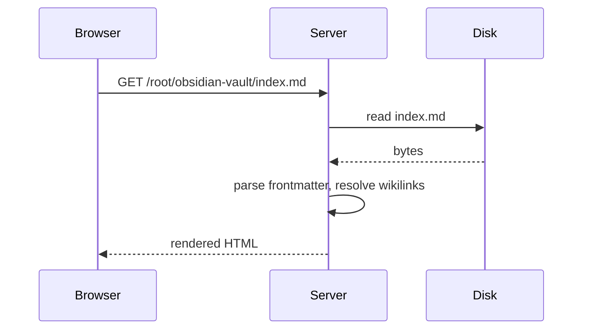
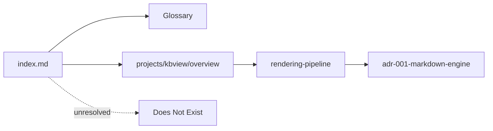

# Math and Diagrams

## Inline math

The area of a square with side $x$ is $x^2$, and Euler's identity is
$e^{i\pi} + 1 = 0$. Inline math sits inside a sentence, so $\alpha + \beta$ must
not break the surrounding paragraph.

## Display math

$$
\int_{-\infty}^{\infty} e^{-x^2} \, dx = \sqrt{\pi}
$$

A multi-line display block:

$$
\begin{aligned}
f(x) &= (x + 1)^2 \\
     &= x^2 + 2x + 1
\end{aligned}
$$

## Not math

A price list must not become math: it costs $5 today and $7 tomorrow.
A single dollar inside code is safe too: `$HOME` and `$PATH`.

## Mermaid

A second mermaid diagram, of the vault's own shape:

## An embedded SVG attachment

![[diagram.svg]]
